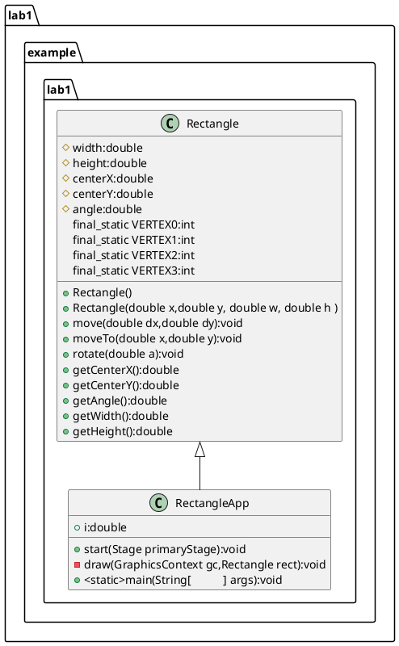

# 1 验证性内容学习情况自查

完成实验1的第2部分内容的学习。

1. 是否完成2.1部分内容，理解类的声明和定义的基本语法，能独立绘制简单类图？
是
2. 是否完成2.2部分内容，理解构造器和初始化器的基本用法，掌握对象的创建与成员访问的基本语法？
是
3. 是否完成2.3部分内容，理解类成员的基本概念以及用法？
是
4. 是否完成2.4部分内容，理解静态环境的概念及用法？
是
5. 是否完成2.5部分内容，熟悉访问控制符的用法?
是
6. 是否存在其他学习问题？ 
否
# 2 矩形类图

## plantUML

