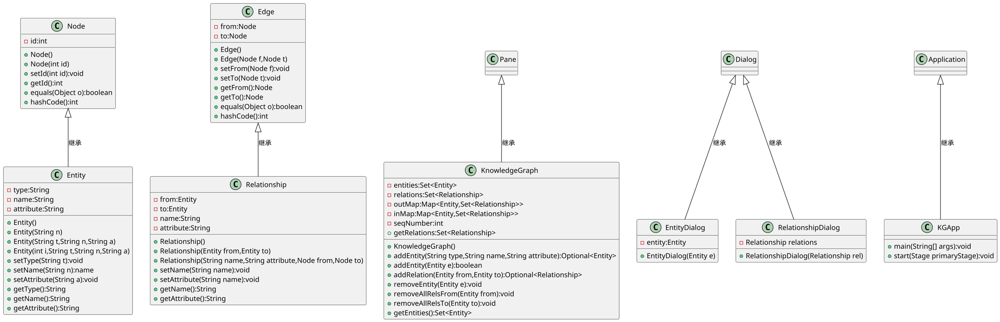

# 1 验证性内容学习情况自查

完成实验1的第2部分内容的学习。

1. 是否完成2.1部分内容，理解方法重载的基本概念和用法
是
2. 是否完成2.2部分内容，理解继承的概念与用法？是否理解父类型变量引用子类型对象？是否掌握方法重写的基本概念和用法？
是
3. 是否完成2.3部分内容，理解嵌套类的概念和用法？是否理解内部类的用法？
是
4. 是否存在其他问题？
否

# 2 类图

使用plantuml语法绘制Node、Edge、Entity、Relationship、KnowledgeGraph等5个核心类的类图，以及它们之间的关系。



# 3 符号提示

```plantuml
@startuml

@enduml
```

